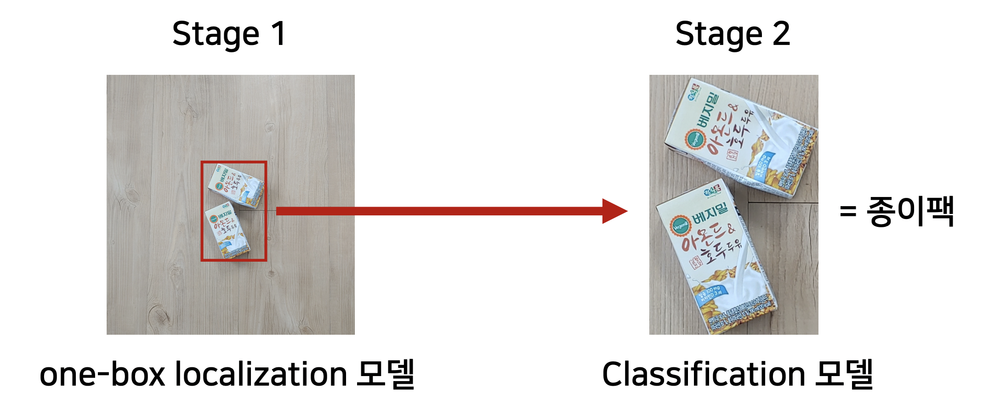

# IITP 생활 종합 인지


## 1단계 핵심 아이디어


<aside>
💡 데이터셋을 확보할 수 있는 예산이 없었기 때문에, 비용을 들이지 않고 데이터를 확보하는 것이 주요

</aside>

- Classification 방식으로 해결
- 데이터셋 확보 전략
    1. 백여종의 쓰레기를 촬영하여 Seed 이미지를 확보
    2. 1의 이미지를 구글 이미지 검색을 통하여 검색하여 검색되는 결과를 크롤링 및 중복제거
    3. Pretrained model 의 Global Pooling 이후 Feature를 Image Vector로 활용하여 Seed 이미지와 가장 유사도가 낮은 이미지들로 다시 2를 수행하는 것을 반복
- 학습전략
    - MultiClass MultiLabel 문제로 접근
    - GradCam 등을 활용하여 취약한 샘플의 원인을 파악하고, 학습전략 수정
        - 음식물이 묻은 사진과 자명한 음식물 쓰레기를 구별하지 못하는 문제를 파악하여, 해당 클래스를 분리시키고 더 많은 학습 데이터를 구축하였음.


## 2단계 핵심 아이디어

<aside>
💡 1단계에서 사용하였던 Classification 방식이 물체 크기가 작을 때 취약하다는 것을 발견하였고, 이를 보정하기 위하여 Two-Stage 방식을 활용하여 문제를 해결하였음.

</aside>

- Two-Stage(One-box localization 모델 + Classification 모델) 방식으로 해결
    
    
    
- 데이터셋 확보 전략
    - 크라우드 소싱을 통해 원천 이미지 수집 후 내부에서 레이블링 진행
- 모델 아키텍처
    - One-Box Localization 모델
        - FPN 네트워크 구조를 응용하여 최종 feature map의 그림자 부분을 통해 물체전체를 감싸는 bbox 도출 모델을 설계. Anchor와 같은 모델의 파라미터를 조절할 필요가 없으며, projection 연산이기 때문에 추가 파라미터와 연산량 증가가 거의 없음.
    - Classification 모델
        - pretrained model weight를 활용하기 위하여 efficientnet, rexnet, resnet 등 여러 네트워크들을 backbone으로 사용함.
- 데이터셋 증폭 전략
    
    
    
- 추론결과 시각화
    
    
    
- Abulation study
    
    
    

## 3단계 핵심 아이디어

<aside>
💡 Object Detection + Active Learning + 이미지 합성 증폭 알고리즘 방식을 활용하여 진행한 데이터셋 구축/학습 프로세스를 통해 연구개발전 개발하였던 Classification CNN model에 비해 비약적인 성능향상을 보여주었으며, 비정형 생활폐기물 이미지(찢김, 손상 등이 많은 이미지)에 대해서도 월등히 높은 성능을 보여주었음

</aside>

- Object Detection 방식으로 해결
- 아키텍처 선택
    - One-stage detector로 추론속도 및 처리 속도 면에서 우수한 성능을 보이는 Yolo계열 모델, 아키텍처 탐색을 통해 기존 fpn 형태를 개선한 EfficietDet, transformer 기반 decoder를 통해 anchor 등과 같은 후처리 알고리즘을 없애고 object detection 문제를 direct set prediction 문제로써 해결하는 (deformable)DETR등 존재하는 다양한 아키텍처 중, 본 테스크에 가장 적합한 아키텍처를 선택하기 위하여 다양한 조건에서 학습을 수행하였으며, 성능지표 및 추론속도 지표에서 모두 높은 성능을 보이는 YOLO 계열 모델로 아키텍처를 선택하였음.
        
        .png)
        
- 데이터셋 확보전략(Active Learning + Pre-labeling Method)
    - Object detection 문제에서 가장 많은 비용이 들어가는 것은 데이터셋 제작임. 일반적으로 단순 분류문제를 풀기위한 데이터셋 제작에 비해 한 이미지 당 약 5~10배정도의 비용이 들어가며, 시간 및 필요인력 또한 비슷한 수준의 추가가 필요함. 뿐만 아니라 다양한 폐기물 관련 데이터셋을 보면 한 이미지를 다양한 각도에서 찍은 사진이 많고, 하나의 폐기물 객체를 여러 이미지에서 다른 구도로 재활용한 경우가 많아 데이터셋의 분포 다양성이 떨어지는 문제가 존재하였음.
    - 데이터셋 다양성이 불충분한 문제로 인하여 데이터셋을 늘려도 모델의 성능 증가폭이 적었으며, overfitting되는 문제가 발생하였음. 이러한 문제를 극복하기 위하여 **취약 샘플 분석을 통한 우선 레이블링 샘플 선택 알고리즘**을 개발하여 학습에 추가적으로 필요한 데이터를 선별적으로 제작할 수 있었음.
    
    .png)
    
- 데이터 증폭 전략(배경합성 알고리즘을 이용한 데이터셋 증폭)
    - 자체 수집한 데이터셋은 대부분이 실내에서 촬영한 이미지라는 문제를 가지고 있었음. 실제 사용환경 및 Testset의 경우 야외 및 특수환경에서도 촬영될 수 있으나, 실제로 기보유한 데이터셋의 경우 야외 배경에서 매우 취약한 문제가 존재하였음. 이를 극복하기 위하여 random bbox 배경합성 알고리즘을 통해 데이터 증폭을 진행하였습니다. 과정은 아래와 같음.
        1. 다양한 배경 데이터셋을 준비 - 약 100여장의 배경 데이터셋 준비(야외, 벤치, 아스팔트, 나무, 잔디 등)
        2. 폐기물 이미지에 대하여 Augmentation 적용 후 bbox에 random margin을 주고 cropping
        3. cropping 된 object set에서 random하게 오브젝트들을 query 하여 1의 배경에 합성
        
        .png)
        
    - 합성 이미지 수/비율 증가에 따른 성능지표
        
        
        | Base Dataset Num | Background Image Num | Manipulate Num | mAP | Class Object Number F1 |
        | --- | --- | --- | --- | --- |
        | 20000 | 0 | 0 | 0.951 | 0.898 |
        | 20000 | 50 | 10000 | 0.953 | 0.902 |
        | 20000 | 100 | 20000 | 0.953 | 0.903 |
        | 36735 | 0 | 0 | 0.960 | 0.916 |
        | 36735 | 50 | 10000 | 0.959 | 0.914 |
        | 36735 | 100 | 10000 | 0.96 | 0.919 |
        | 36735 | 100 | 20000 | 0.963 | 0.92 |
        | 36735 | 100 | 30000 | 0.963 | 0.923 |
        | 36735 | 100 | 40000 | 0.961 | 0.921 |
- Validation Set Augmentation 평가를 통한 Sample distribution discrepancy 해소
    - 연구과정에서 실제 활용단계에서 처음보는 sample 에 대한 성능을 validation set 성능지표 가 반영하고 있지 못하다고 판단함. 실제로 2020년 참여한 인공지능 그랜드 챌린지에서 89.44%라는 f1 score 로 우승하였으나, 자체적인 validation dataset으로 평가한 자체 성능평가 지표는 95%이상이었음. 뿐만아니라, 제출했던 모델 중 가장 높은 성능을 보인 모델은 제출한 다른 모델에 비해 자체 평가데이터셋에 대해서는 성능이 낮은 모델이었음. 즉, 자체적으로 평가한 모델의 성능지표가 처음보는 dataset에 대해 완벽히 대변하지 못한다는 것을 의미하였음.
    - 이는 연구개발과정에서 validation dataset의 성능지표를 기반으로 모델을 개선하기 때문에, 개선의 방향이 validation set에 overfitting 될 수 있기 때문으로 판단하였고, 이를 극복하기 위하여 validation set의 평가방식에 augmentation 및 배경합성 알고리즘을 적용하여, 주어진 validation dataset의 real world sample distribution discrepancy를 해소하였음.
    - 실제 대회의 평가데이터셋으로 ablation study를 진행한 결과 단순 validation set 테스트 지표로 평가한 모델에 비하여 augmentation을 적용하여 평가한 방식에서의 모델의 성능지표 경향성이 일치하였음.
    
    | model number | 자체 평가 데이터셋 | 자체 평가 데이터셋(Augmented) | 대회제공 샘플 데이터셋 | 대회제공 샘플 데이터셋(Augmented) | 실제 점수 |
    | --- | --- | --- | --- | --- | --- |
    | 1 | 0.913 | 0.904 | 0.888 | 0.881 | 0.874 |
    | 2 | 0.916 | 0.906 | 0.884 | 0.881 | 0.882 |
    | 3 | 0.921 | 0.913 | 0.894 | 0.887 | 0.894 |
    | 4 | 0.922 | 0.909 | 0.891 | 0.886 | 0.889 |
    | 5 | 0.923 | 0.911 | 0.897 | 0.884 | 0.892 |


## 4단계 핵심 아이디어

<aside>
💡 4단계 과제는 복합 재난 시나리오이며 어떤 구도와 소품 등으로 테스트셋이 구축될지 모르는 상황이므로 모델 일반화가 매우 중요한 테스크임. 
따라서 자체적인 데이터셋을 구축하는 방향이 아닌 최대한 Pretrained Model을 그대로 활용하고 해당 결과를 후처리 하는식으로 알고리즘을 구성하였음.

</aside>

### 비디오 정보 추출

1. OCR 모델을 활용하여 영상시간, 캠번호 추출
2. Track3 여부 추출
    - Track3영상이 Track1&2 영상보다 사람의 크기가 크다는 것에 착안하여 알고리즘 구성
    - 전체영상에서 60프레임을 샘플링하여 해당 프레임에서 사람 bbox를 추출하고, 영상별로 bbox 너비 평균값을 확보한 뒤, 영상별 너비 평균값의 평균보다 큰 영상은 track3로 판정

### Track1

1. 영상을 2초당 1프레임으로 이미지를 추출
2. 첫 프레임에서 간판정보 추출
    - OCR 모델을 활용하여 모든 글자를 인식
    - predefined json에 존재하는 간판들과 OCR output 들과의 유사도를 계산하여 가장 유사도가 높은 간판 위치정보를 확보. 이 때 같은 간판에 대해서 서로다른 place 정보에 대해서 유사도가 가장 높다면 유사도가 높은 place 만 남기고 나머지는 삭제
        
        
        
3. 실신 사람 추출
    1. 이미지에서 아래와 같이 5개의 패치를 추출하고, 각 패치에서 사람을 추출 
        
        
        
    2. 추출한 사람이미지의 bbox의 height/width가 0.7이하이고, 각 패치의 가장자리가 아닐 때 해당 bbox를 저장 - 중복 인식 방지
    3. 각 이미지에서의 복수의 실신한 사람 정보를 확보
4. 개별 실신 사람 인식
    - 연속적인 영상 상에서 같은 사람을 두번 답안으로 제출하지 않도록 20초 이내 IOU가 0.3 이상되는 bbox들은 합치고, 각각의 실신한 인원을 확보
5. 쓰러진 사람들의 위치정보 추출
    - 4를 통해 영상 몇초에 어디에서 사람이 실신했는지 정보를 가지고 있으므로 각 실신인원 bbox의 무게중심 x좌표(x1)를 기반으로 2의 간판정보에 조회하여 x1을 포함하는 간판이 존재하는지 조회.
        - 조회된 간판이 여러개일 경우 그 중 place 정보와 유사도가 가장 높은 간판을 선택
        - 조회된 간판이 없는 경우 간판 무게중심의 x좌표(x2)와 x1사이의 거리가 가장 짧은 간판을 선택
    
    
    


**초기 추론 파이프라인**

1. 첫 프레임에서 OCR모델로 (동영상 프레임 → Cam No, 타임스탬프) 추출하기
2. 동영상에서 음원 추출
3. STT 모델로 (음원 → 타임스탬프 + 텍스트) 변환
4. 인식된 텍스트들 대화로 그룹핑하기
5. 그룹핑된 대화 별로 대화 유형 분류하기
6. 일상 대화를 제외하고, 나머지 대화를 폭력 대화에 대해서 답안 JSON 생성 후 제출

**개선된 추론 파이프라인**

1. 첫 프레임에서 OCR모델로 (동영상 프레임 → Cam No, 타임스탬프) 추출하기
2. 동영상에서 음원 추출
3. VAD 모델로 음성이 포함된 음원 구간만 분리
4. STT 모델로 (음성이 포함된 음원 → 타임스탬프 + 텍스트) 변환
5. 대화 그룹핑하기
6. 그룹핑된 대화 별로 대화 유형 분류하기
7. 일상 대화를 제외하고, 나머지 대화를 폭력 대화에 대해서 답안 JSON 생성 후 제출

<aside>
⚠️ Voice Activation Detection 모델을 활용해서 무음 구간을 제외하고 음성이 있는 세그먼트에 대해서만 STT 모델을 실행시켜서 추론 시간을 감소시킴

</aside>

**OCR**

- EasyOCR이 정말 쉽게 라이브러리를 구현해놨음
    
    [https://github.com/JaidedAI/EasyOCR](https://github.com/JaidedAI/EasyOCR)
    
- 언어도 변경 가능하며, 원하는대로 글자 감지 모듈과 글자 인식 모듈을 변경해서 구성 가능함
- 특히 글자 인식 모듈에서 allowlist를 지정해서 주어진 문자 집합 내에서만 글자가 인식되도록 제한이 가능함

```python
def get_cam_number(image, ocr_engin):
    allowlist = list('aAcCmM0123456789')

    height, width, _ = image.shape
    cam_number = image[:150, 1620: ,:]
    cam_number_ocr_result = ocr_engin.readtext(cam_number, detail=0, allowlist=allowlist)

def get_video_time(image, ocr_engin):
    allowlist = list('0123456789:.')

    height, width, _ = image.shape
    video_time = image[900:, 1520: ,:]
    video_time_ocr_result = ocr_engin.readtext(video_time, detail=0, allowlist=allowlist)

reader = easyocr.Reader(['en'], model_storage_directory=model_storage_directory, user_network_directory=user_network_directory, download_enabled=False)
cam_num, start_timestamp = get_cam_number(image, reader), get_video_time(image, reader)
```

**VAD (Voice Activity Detection)**

- STT 모델은 기본적으로 많은 연산량을 요구하다보니 150분 음원을 모두 STT 실행 시 50분 이상 소요됨
- 동영상 내에 음성이 없는 구간이 충분히 많이 있을 것이란 가정 하에 가벼운 음성 감지 모델만 먼저 돌리기
- pyannote 라는 라이브러리를 발견했으며 음성 인식, 화자 분리 등등 생각할 수 있는 거의 대부분을 지원함
    
    [https://github.com/pyannote/pyannote-audio](https://github.com/pyannote/pyannote-audio)
    
- 발화 간의 간격이 10초 이상을 넘어가면 서로 다른 대화라고 생각하고 10초 안쪽으로 붙어있는 발화들을 같은 대화라고 가정하고 병합

```python
import moviepy as mp
my_clip = mp.VideoFileClip(video_path)

sound_array = my_clip.audio.to_soundarray(fps=16000)
audio = {
    "waveform": torch.tensor(np.transpose(sound_array), dtype=torch.float32),
    "sample_rate": 16000
}

vad_model = Model.from_pretrained("pyannote/segmentation", cache_dir=vad_model_path, local_files_only=True)
vad_pipeline = VoiceActivityDetection(segmentation=vad_model)
HYPER_PARAMETERS = {
  "onset": 0.5, "offset": 0.5,
  "min_duration_on": 0.0,
  "min_duration_off": 0.0
}
vad_pipeline.instantiate(HYPER_PARAMETERS)

vad_result = vad_pipeline(audio)
scene_list = split_scene(vad_result)
```

**STT (Speech-to-Text)**

- 대회에서 허용하는 9/30 이전에 나온 모델 중에 OpenAI에서 STT 모델을 공개함
- 68만 시간의 분량의 다국어 음성을 포함시켜서 상당히 높은 정확도를 가지고 있으며 저자에 한국인도 있어서 그런지 한국어 데이터셋의 비중이 꽤 되고 성능도 훌륭한 편
- 모델 용량은 2.9GB 정도

```python

import whisper
stt_model = whisper.load_model("large", download_root=stt_model_path)
sample_rate = 16000 #16kHz
safe_margin = 2 # VOD에 의해서 발화 앞뒤 음성이 미묘하게 짤릴 때 위스퍼에 의해서 token looping이 발생하는 경우가 있어서 장면 앞뒤로 2초씩 음성 추가

for scene in scene_list:
	  scene_start_index = max(int((scene[0] - safe_margin) * sample_rate), 0)
	  scene_end_index = min(int((scene[1] + safe_margin) * sample_rate), len(audio_np_array))
	
	  audio_tensor = audio_np_array[scene_start_index: scene_end_index].to(stt_model.device)
	  decode_option = {'language':'ko', 'initial_prompt':"- How are you? - I'm fine, thank you."}
	  result = whisper.transcribe(stt_model, audio_tensor, **decode_option)
	  if len(result['segments']) > 0:
	      dialogue = Dialogue(start=scene[0], end=scene[1], segments=result)
	      dialogue_list.append(dialogue)
```

위스퍼 모델을 쓰면서 놀라웠던 부분

- `inital_prompt` 를 활용하면 대화체로 인식이 훨씬 잘됨
    
    .png)
    
    위 : initial_prompt 없을 때 인식 결과. 몇몇 발화가 하나의 발화로 묶임. 아래 : initla_prompt를 넣어줬을 때. 정확하게 발화 문장 별로 분리됨
    
- 영어로 말한 부분을 한국어로 번역도 하는 경우가 종종 있음.
    
    방송에서 `Thank you for your unique style` 이라고 언급했는데 음성 인식 후 모델 내부에서 한국어로 번역도 하는 모습을 볼 수 있음 
    
    
    

**폭력 분류기**

- 한국어 기반의 문장 분류기는 마땅히 없었던 상황이라 직접 학습시킴
- 다행히 이 문제에 참가했던 튜닙에서 대회 참여하면서 만든 데이터셋을 공개해줌
    
    [https://github.com/tunib-ai/DKTC](https://github.com/tunib-ai/DKTC)
    
- 다만 폭력 대화만 있었기 때문에 일상대화 데이터셋이 더 필요했음
    - [AIhub에 일상 대화 데이터가 있었음](https://www.aihub.or.kr/aihubdata/data/list.do?pageIndex=1&currMenu=115&topMenu=100&dataSetSn=&srchdataClCode=DATACL001&srchOrder=&SrchdataClCode=DATACL002&searchKeyword=%EC%A3%BC%EC%A0%9C&srchDataRealmCode=REALM002&srchDataTy=DATA003)
- 한국어 pre-trained 모델은 [roberta-large 모델](https://huggingface.co/klue/roberta-large)을 활용함
- 약 5000개의 문장을 가지고 3 epoch 정도 학습시켜서 91% 분류 정확도 확인하여 별다른 튜닝은 진행하지 않고 추론에 활용

### Track3


1. 분리수거 종류별 표지판 감지
    - 표지판을 Segmentation 한 뒤 배경이 지워진 Sample dataset에 랜덤한 위치에 표지판을 배치하고, 해당 표지판을 detection 하는 모델을 제작
    
    
2. 쓰레기통의 입구 추출
    - 쓰레기통 입구를 detection
3. 좌표값 기반으로 1,2를 이용하여 어떤 쓰레기통에 어떤 클래스인지를 감지
4. 각 쓰레기통 입구 영역별 크롭된 프레임에 대해서 사람이 쓰레기를 버리는 순간을 감지하는 모델 
    
    
    
5. 감지된 순간에 해당 쓰레기통에서 들어가고있는 쓰레기를 분류하는 모델
    - 기존 확보 데이터셋을 합성하는 방식으로 데이터셋 제작
    
    
